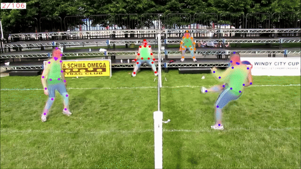
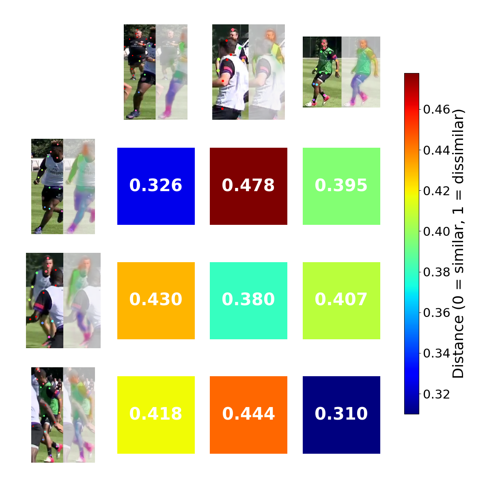
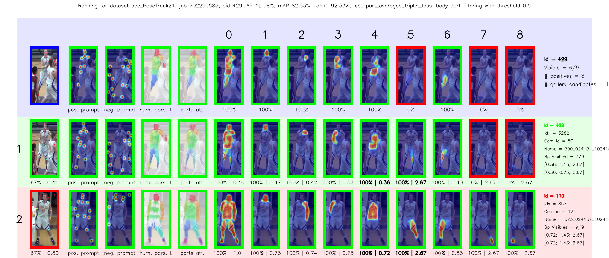
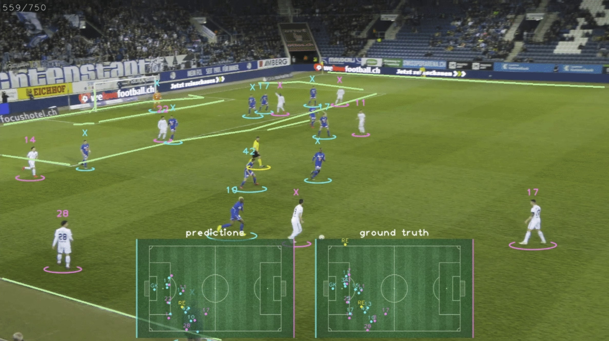

<!-- TODO

-->

<div align="center">
 
# KPR: Keypoint Promptable Re-Identification
[[Paper](https://arxiv.org/abs/2407.18112)] [[GitHub](https://github.com/VlSomers/keypoint_promptable_reidentification)] [[Demo](torchreid/demo.py)] [[Video](https://www.youtube.com/watch?v=IatrRfXrdnE)] [[Poster](assets/ECCV24_KPR_poster.pdf)] [[BPBreID](https://github.com/VlSomers/bpbreid)] [[TrackLab](https://github.com/TrackingLaboratory/tracklab)]

[](https://arxiv.org/abs/2407.18112) [](https://firstdonoharm.dev/version/3/0/law-media-mil-soc-sv.html)

🔥 *SOTA ReID model, with optional keypoint prompts, that is robust to multi-person occlusions* 🔥

✅ *Plug-and-play with any pose estimator or through manual keypoint selection*

🚀 *Release of the **Occluded-PoseTrack-ReID** dataset with manual keypoint annotations + keypoints annotations for four existing ReID benchmarks* 

KPR can be easily integrated into any codebase to perform person retrieval, person search, multi-person (pose) tracking, multi-view multi-skeleton matching for 3D pose, ...

SOTA performance with the [SOLIDER](https://github.com/tinyvision/SOLIDER) human-centric foundation model as backbone.

</div>

 <p align="center">
  
  
</p>

>**[Keypoint Promptable Re-Identification, ECCV24](https://arxiv.org/abs/2407.18112)**
>
>Vladimir Somers, Alexandre Alahi, Christophe De Vleeschouwer
>
>[*arxiv 2407.18112*](https://arxiv.org/abs/2407.18112)
>
### State-of-the-art performance on 5 datasets:

Occluded-PoseTrack-ReID: [](https://paperswithcode.com/sota/person-re-identification-on-occluded?p=keypoint-promptable-re-identification)

Occluded-Duke: [](https://paperswithcode.com/sota/person-re-identification-on-occluded-dukemtmc?p=keypoint-promptable-re-identification)

Occluded ReID: [](https://paperswithcode.com/sota/person-re-identification-on-occluded-reid-1?p=keypoint-promptable-re-identification)

Partial-ReID: [](https://paperswithcode.com/sota/person-re-identification-on-partial-reid?p=keypoint-promptable-re-identification)

Market1501: [](https://paperswithcode.com/sota/person-re-identification-on-market-1501?p=keypoint-promptable-re-identification)

<!--
Table of content tool:
https://ecotrust-canada.github.io/markdown-toc/
-->
## Table of content
- [KPR: Keypoint Promptable Re-Identification](#kpr-keypoint-promptable-re-identification)
  * [Table of content](#table-of-content)
  * [Update](#update)
  * [What's next](#whats-next)
  * [🚀 Demo](#-demo)
  * [Introduction to Keypoint Promptable Re-Identification](#introduction-to-keypoint-promptable-re-identification)
    + [Multi-Person Ambiguity (MPA)](#multi-person-ambiguity-mpa)
    + [New Occluded-PoseTrack-ReID dataset](#new-occluded-posetrack-reid-dataset)
    + [Part-based Re-Identification](#part-based-re-identification)
  * [What to find in this repository](#what-to-find-in-this-repository)
  * [Installation instructions](#installation-instructions)
    + [Installation](#installation)
    + [Download the Occluded-PoseTrack Re-Identification dataset](#download-the-occluded-posetrack-re-identification-dataset)
      - [Generate the dataset](#generate-the-dataset)
    + [Download annotations for existing datasets](#download-annotations-for-existing-datasets)
    + [Download the pre-trained models](#download-the-pre-trained-models)
  * [Running KPR](#running-kpr)
    + [Inference](#inference)
    + [Training](#training)
    + [Visualization tools](#visualization-tools)
  * [Further work](#further-work)
  * [Other works](#other-works)
  * [Notes](#notes)
  * [Questions and suggestions](#questions-and-suggestions)
  * [Citation](#citation)
  * [Acknowledgement](#acknowledgement)


## Update
- [2024.08.23] Full codebase release
- [2024.07.10] Dataset and weights release

## What's next
We plan on extending this codebase in the near future, put a star and stay updated for future changes:
- [ ] we plan to release soon the feature for joint multi-dataset training. Additionnaly, we will release some KPR weights jointly trained on multiple reid/tracking datasets, to increase its cross-domain performance.
- [ ] release of the multi-person pose tracking codebase that is based on [TrackLab](https://github.com/TrackingLaboratory/tracklab).

## 🚀 Demo
We provide a simple [demo script](demo.py) to demonstrate how to use KPR with the provided pre-trained weights to perform person re-identification. 
Given an input sample (image crop + prompt), KPT outputs (1) part-based embeddings and (2) visibility scores for each part, that are then used to compute a similarity scores between pairs of samples.
The image below depicts the similarity matrix between 6 samples of 3 different persons.
Colored dots illustrates positive keypoints prompts and red dots are negative prompts.
Colored heatmaps denotes the output part attention maps of KPR, illustrating where "the model looks at". 
The keypoint prompts are optional and can be used only when necessary, e.g. when there is a multi-person occlusion scenario. 
More information is provided in the demo file.

<p align="center">
  
</p>

## Introduction to Keypoint Promptable Re-Identification
Welcome to the official repository of our ECCV24 paper "Keypoint Promptable Re-Identification".
In this work, we propose KPR, a **keypoint promptable method for part-based person re-identification**.
KPR is a SWIN transformer-based model that takes an RGB image along with a set of **semantic keypoints** as input (i.e. the prompt). 
It then produces a set of **part-based features**, each representing a distinct body part of the ReID target, along with their respective **visibility scores**.
A visibility score indicates whether a body part is visible or occluded in the input image, so that only visible parts are considered when comparing two persons.
Our method can process both **positive** and **negative** keypoints, which respectively represent the target and non-target pedestrians.
Furthermore, KPR is designed to be **prompt-optional** to offer more practical flexibility: this means the same model can be used without prompt on non-ambiguous images, or with prompt when dealing with occlusions, while consistently achieving state-of-the-art performance in both cases.

&nbsp;
<p align="center"></p>
&nbsp;

### Multi-Person Ambiguity (MPA)
Our method is designed to be robust to any type of occlusion, including occlusions involving multiple persons that causes Multi-Person Ambiguity.
Multi-Person Ambiguity (MPA) arises when multiple individuals are visible in the same bounding box, making it challenging to determine the intended ReID target among the candidates.
To address this issue, KPR is fed with additional keypoint prompts indicating the intended ReID target.

### New Occluded-PoseTrack-ReID dataset
To encourage further research on promptable ReID, we release our proposed Occluded-PoseTrack-ReID dataset, a multi-person occluded ReID dataset with explicit target identification through manual keypoints annotations.
Furthermore, we propose new keypoint annotations for four popular re-identification datasets (Market-1501, Occluded-Duke, Occluded-ReID and Partia-ReID) to provide a common setup for researchers to compare their promptable ReID methods.

&nbsp;
<p align="center"></p>
&nbsp;

### Part-based Re-Identification
Our work is built on top of [BPBreID](https://github.com/VlSomers/bpbreid), a strong baseline for part-based person re-identification. 
As illustrated in the figure below, **part-based** ReID methods output multiple embeddings per input sample, i.e. one for each part, whereas standard global methods only output a single embedding.
Compared to global methods, part-based ones come with some advantages:

1. They achieve explicit appearance feature alignment for better ReID accuracy.
2. They are robust to occlusions, since only mutually visible parts are used when comparing two samples.

Our model KPR uses pseudo human parsing labels at training time to learn an attention mechanism. 
This attention mechanism has K branches to pool the global spatial feature map into K body part-based embeddings. 
Based on the attention maps activations, visibility scores are computed for each part.
At test time, no human parsing labels is required.
The final similarity score between two person images is computed using the average distance of all mutually visible part-based embeddings.
Please refer to [our paper](https://arxiv.org/abs/2407.18112) and to [BPBreID](https://github.com/VlSomers/bpbreid) for more information.

&nbsp;
<p align="center"></p>
&nbsp;

<!--
&nbsp;
<p align="center"></p>
&nbsp;

&nbsp;
<p align="center"></p>
&nbsp;
-->

## What to find in this repository
In this repository, we propose a framework and a strong baseline to support further research on keypoint promptable ReID methods.
Our code is based on [BPBreID](https://github.com/VlSomers/bpbreid) and the popular [Torchreid](https://github.com/KaiyangZhou/deep-person-reid) framework for person re-identification.
In this codebase, we provide several adaptations to the original framework to support promptable part-based ReID methods.
Changes compared to Torchreid:
- The [ImagePartBasedEngine](torchreid/engine/image/part_based_engine.py) to train/test part-based models with prompts, compute query-gallery distance matrix using multiple features per test sample with support for visibility scores.
- The fully configurable [GiLt loss](/torchreid/losses/GiLt_loss.py) to selectively apply id/triplet loss on holistics (global) and part-based features.
- The [BodyPartAttentionLoss](torchreid/losses/body_part_attention_loss.py) to train the attention mechanism.
- The [KPR](torchreid/models/kpr.py) part-based promptable model to compute part-based features with support for keypoint prompts as input, body-part learnable attention, fixed attention heatmaps from an external model, PCB-like horizontal stripes, etc.
- The [Albumentation](https://albumentations.ai/) data augmentation library used for data augmentation, that jointly transforms the image, keypoints prompts and human parsing labels.
- Support for [Weights & Biases](https://wandb.ai/site) and other logging tools in the [Logger](torchreid/utils/logging/logger.py) class.
- An [EngineState](torchreid/utils/engine_state.py) class to keep track of training epoch, etc.
- A new [ranking visualization](torchreid/utils/visualization/visualize_query_gallery_rankings.py) tool to display part heatmaps, prompts, local distance for each part and other metrics (example image [here](https://github.com/VlSomers/person-reid?tab=readme-ov-file#visualization-tools)).
- For more information about all available configuration and parameters, please have a look at the [default config file](torchreid/scripts/default_config.py).


You can also have a look at the original [Torchreid README](Torchreid_original_README.rst) for additional information, such as documentation, how-to instructions, etc.
Be aware that some of the original Torchreid functionnality and models might be broken (for example, we don't support video re-id yet).


## Installation instructions
### Installation
Make sure [conda](https://www.anaconda.com/distribution/) is installed.

    # clone this repository
    git clone https://github.com/VlSomers/keypoint_promptable_reidentification

    # create conda environment
    cd kpr/ # enter project folder
    conda create --name kpr python=3.10 pytorch==1.13.0 torchvision==0.14.0 pytorch-cuda=11.7 -c pytorch -c nvidia -y
    conda activate kpr

    # install dependencies
    # make sure `which python` and `which pip` point to the correct path
    pip3 install -r requirements.txt

    # (optional) install openpifpaf if you want to generate your own human parsing annotations
    # this is not required for most installations since human parsing labels are provided for download
    pip3 install -e "git+https://github.com/PbTrack/openpifpaf@pbtrack#egg=openpifpaf[test]"
    
    # install torchreid (don't need to re-build it if you modify the source code)
    python3 setup.py develop
    

### Download the Occluded-PoseTrack Re-Identification dataset
- **Download [PoseTrack21](https://github.com/anDoer/PoseTrack21?tab=readme-ov-file#how-to-get-the-dataset)**.
- **Download [Occluded-PoseTrack ReID annotations](https://drive.google.com/file/d/1B1v11Yw56AIxxzDHnnymi4NPkNRDYkvJ/view?usp=sharing)**.

> [!NOTE]
> Unfortunately we don't have the right to host and share a subset of PoseTrack21. This is why PoseTrack21 should be first downloaded from the [original repository](https://github.com/anDoer/PoseTrack21?tab=readme-ov-file#how-to-get-the-dataset) and then turned into a ReID dataset with our script.

Our proposed dataset is derived from the [PoseTrack21](https://github.com/anDoer/PoseTrack21) dataset for multi-person pose tracking in videos.
The original PoseTrack21 dataset should be first downloaded following these [instructions](https://github.com/anDoer/PoseTrack21?tab=readme-ov-file#how-to-get-the-dataset).
We also provide json files that specify how the pose tracking annotations should be turned into our ReID dataset.
These json files describes which detections (bounding boxes + keypoints) should be used as train/query/gallery samples.
We provide these files and the related human parsing labels on [GDrive](https://drive.google.com/file/d/1B1v11Yw56AIxxzDHnnymi4NPkNRDYkvJ/view?usp=sharing).
These files are read by our codebase to extract the ReID dataset from the pose tracking one and save the corresponding image crops on disk before launching the ReID experiment.
They can also be integrated in any external codebase in a similar manner.
The transformation from a tracking to a ReID dataset is performed within the [OccludedPosetrack21](torchreid/data/datasets/image/occluded_posetrack21.py) class.
The human parsing labels were generated using [SAM](https://github.com/facebookresearch/segment-anything) and [PifPaf](https://github.com/openpifpaf/openpifpaf), more details are provided in the [paper](https://arxiv.org/abs/2407.18112).

#### Generate the dataset
Our codebase will generate the Occluded-PoseTrack Re-Identification dataset the first time you run the [test](https://github.com/VlSomers/person-reid/tree/kpr-clean#inference) or [train](https://github.com/VlSomers/person-reid/tree/kpr-clean?tab=readme-ov-file#training) code. 
The codebase will look for the dataset by default under "~/datasets/reid/PoseTrack21".
Either place your downloaded dataset there, or choose a new location under the `cfg.data.root` config, e.g. `cfg.data.root = "/path/to/PoseTrack21"` inside [default_config.py](torchreid/scripts/default_config.py), L177 (just specify the path to the folder containing the 'PoseTrack21' folder).
Finally, put the downloaded Occluded-PoseTrack ReID annotations in the PoseTrack21 folder, under `PoseTrack21/occluded_posetrack_reid`.
The ReID image crops will be extracted in that folder.
Keypoints annotations are not saved in the `occluded_posetrack_reid` folder, but loaded at runtime from the PoseTrack21 json files inside `posetrack_data`.
Feel free to open a GitHub issue if you encounter any issue during the dataset generation or need further information.

<details>

<summary>Here is an overview of the final folder structure</summary>


    PoseTrack21
    ├── images                              # contains all images  
    │   ├── train
    │   ├── val
    ├── posetrack_data                      # contains annotations for pose reid tracking
    │   ├── train
    │   │   ├── 000001_bonn_train.json
    │   │   ├── ...
    │   ├── val
    │       ├── ...
    ├── posetrack_mot                       # contains annotations for multi-object tracking 
    │   ├── mot
    │   │   ├── train
    │   │   │   ├── 000001_bonn_train
    │   │   │   │   ├── image_info.json
    │   │   │   │   ├── gt
    │   │   │   │       ├── gt.txt          # ground truth annotations in mot format
    │   │   │   │       ├── gt_kpts.txt     # ground truth poses for each frame
    │   │   │   ├── ...
    │   │   ├── val
    ├── posetrack_person_search             # person search annotations
    │   ├── query.json
    │   ├── train.json
    │   ├── val.json
    ├── occluded_posetrack_reid             # new occluded-posetrack-reid annotations
    │   ├── images                          # image crops generated when running KPR for the first time
    │   ├── masks                           # human parsing labels
    │   ├── train_dataset_sampling.json     # which detection samples to use for training
    │   ├── val_dataset_sampling.json       # which detection samples to use for evaluation, with a query/gallery split

</details>


### Download annotations for existing datasets
You can download the keypoint and human parsing labels for **Market-1501**, **Occluded-Duke**, **Occluded-ReID** and **Partia-ReID** on [GDrive](https://drive.google.com/drive/folders/15_RdnS1nr3iAYcnCibXmbT1LxU2n8PHZ?usp=sharing). 
The human parsing labels (.npy) were introduced by [BPBreID](https://github.com/VlSomers/bpbreid).
The keypoint annotations (.json) were generated with the [PifPaf](https://github.com/openpifpaf/openpifpaf) pose estimation model.
When multiple skeletons are detected within a single bounding box, the one with its head closer to the top center part of the image is considered as the ReID target, and marked with an 'is_target' attribute.
Around 10% of the query samples in the Occluded-Duke dataset were annotated manually because either the target person was not correctly labeled or the target person was not detected.
For Partiel-ReID, the first skeletons in the list is considered as the target.
For more detalsl, please have a look at the [paper](https://arxiv.org/abs/2407.18112).
After downloading, unzip the file and put the `masks` folder under the corresponding dataset directory.
For instance, Market-1501 should look like this:

    Market-1501-v15.09.15
    ├── bounding_box_test
    ├── bounding_box_train
    ├── external_annotation
    │   └── pifpaf_keypoints_pifpaf_maskrcnn_filtering
    │       ├── bounding_box_test
    │       ├── bounding_box_train
    │       └── query
    ├── masks
    │   └── pifpaf_maskrcnn_filtering
    │       ├── bounding_box_test
    │       ├── bounding_box_train
    │       └── query
    └── query

The `external_annotation` folder contains the keypoint annotations (with on json file per dataset sample) that are used as prompts at both training and test/inference time.
The `masks` folder contains the human parsing labels that are used at training time only to supervise the part-based attention mechanism.
Make also sure to set `data.root` config to your dataset root directory path, i.e., all your datasets folders (`Market-1501-v15.09.15`, `Occluded_Duke`, `Occluded_REID`, `Partial_REID`) should be under this path.

### Download the pre-trained models
We also provide some [state-of-the-art pre-trained models](https://drive.google.com/drive/folders/1t4wXc2c3qlFaqUCifAlc_OPrFwvb7peD?usp=sharing) based on the Swin backbone.
You can put the downloaded weights under a 'pretrained_models/' directory or specify the path to the pre-trained weights using the `model.load_weights` parameter in the `yaml` config.
The configuration used to obtain the pre-trained weights is also saved within the `.pth` file: make sure to set `model.load_config` to `True` so that the parameters under the `model.kpr` part of the configuration tree will be loaded from this file.

## Running KPR
### Inference
You can test the above downloaded models on five popular ReID benchmarks using the following command:

    conda activate kpr
    python main.py --config-file configs/kpr/<pretraining>/kpr_<target_dataset>_test.yaml
    
For instance, for the Occluded-PoseTrack ReID dataset with the SOLIDER-based KPR model:

    conda activate kpr
    python main.py --config-file configs/kpr/solider/kpr_occ_posetrack_test.yaml
    
Configuration files for other datasets and pretraining weights are available under `configs/kpr/`.
Make sure the `model.load_weights` in these `yaml` config files points to the pre-trained weights you just downloaded with [above instructions](https://github.com/VlSomers/person-reid/tree/dev-vlad?tab=readme-ov-file#download-the-pre-trained-models). 

### Training
The training configs for five datasets (Occluded-PoseTrack-ReID, Occluded-Duke, Market-1501, Occluded-ReID and Partial-ReID) are provided in the `configs/kpr/` folder. 
A training procedure can be launched with:

    conda activate kpr
    python ./main.py --config-file configs/kpr/<pretraining>/kpr_<target_dataset>_train.yaml
    
For instance, for the Occluded-Duke dataset with the SOLIDER pretrained weights:

    conda activate kpr
    python main.py --config-file configs/kpr/solider/kpr_occ_duke_train.yaml

Make sure to [download and install the human parsing labels](https://github.com/VlSomers/person-reid/tree/dev-vlad?tab=readme-ov-file#download-annotations-for-existing-datasets) for your training dataset before running this command.

> [!NOTE]
> This codebase has undergone a big refactoring for the public release. If you cannot replicate some of the reported performance, there is very likely an issue with the training configs, so please open a GitHub issue.


### Visualization tools
The ranking visualization tool is activated by default, with the `test.visrank` config set to `True` in the [default_config.py](torchreid/scripts/default_config.py) file.
As illustrated below, this tool displays the Top-K ranked samples as rows (K can be set via `test.visrank_topk`). The first row with blue background is the query, and the following green/red rows indicated correct/incorrect matches.
The attention maps for each test embedding (foreground, parts, etc) are displayed in the row.
The colored heatmaps depicts the attention maps on each each body part, with one color per part.
An attention map has a green/red border when it is visible/unvisible. 
The first number under each attention map indicate the visibility score and the second number indicate the distance of the embedding to the corresponding query embedding.
The distances under the images in the first column on the left are the global distances of that sample to the query, which is usually computed as the average of all other distances weighted by the visibility score.
If you need more information about the visualization tool, fell free to open an issue.

&nbsp;
<p align="center"></p>
&nbsp;

## Further work
There are plenty of ideas to improve KPR, feel free to explore them:
1. Improve KPR cross-domain performance. 
2. Investigate using KPR to perform retrieval based on a specific body part (e.g., click on a person’s boots to find others with similar boots).
3. Make KPR work with various type of input prompt: bboxes, segmentation masks, language, etc. 
4. Study how KPR would perform with few non semantic keypoints (a few clicks on any part of the target body). 
5. Build a more difficult dataset, with images from various domains and complex occlusions involving both humans and objects. 
6. Design a more efficient prompting mechanism that would not require to transform keypoints into heatmaps (SAM-like)
7. ...

## Other works
Please have a look at our other works on re-identification and sport video analysis:
- [BPBreID: Body Part-based Re-Identification](https://github.com/VlSomers/bpbreid)
- [SoccerNet End-to-End Athlete Tracking and Identification on a Minimap](https://github.com/SoccerNet/sn-gamestate)
- [PRTreID: Joint Learning for Re-identification, Team Affiliation, and Role Classification](https://github.com/VlSomers/prtreid)
- The [SoccerNet Player Re-Identification](https://github.com/SoccerNet/sn-reid) dataset
- The [DeepSportRadar Player Re-Identification](https://github.com/DeepSportRadar/player-reidentification-challenge) dataset 

<p align="center">
  
  
   
</p>

## Notes
I will try to discuss here various implementation choices, future research direction, open issues, etc. Feel free to open a Github issue if you have any question or suggestion.
1. About BIPO data augmentation: Automatically generating keypoints prompts and human parsing labels for multi-person occluded images using external models (OpenPifPaf, SAM, etc) is challenging and often imperfect, whereas these models are extremely accurate for single-person images. Hence, using BIPO to merge two single-person images to create a new occluded image with the corresponding labels (human parsing masks + keypoint prompts) proves more reliable than directly labeling real multi-person occluded images.
2. SOLIDER was hard to fine-tune, the “semantic_weight" parameter did not have much impact. It was necessary to freeze the keypoint tokenizer for
the first 20 epochs (with the `train.fixbase_epoch` config) and use a small learning rate.
3. The codebase has undergone big refactoring before public release and the provided training configuration might be incomplete, please let me know if you cannot reproduce the reported results.

## Questions and suggestions
If you have any question/suggestion, or find any bug/issue with the code, please raise a GitHub issue in this repository, I'll be glab to help you as much as I can!
I'll try to update the documentation regularly based on your questions. 


## Citation
If you use this repository for your research or wish to refer to our method KPR, please use the following BibTeX entry:

```
@misc{somers2024keypointpromptablereidentification,
      title={Keypoint Promptable Re-Identification}, 
      author={Vladimir Somers and Christophe De Vleeschouwer and Alexandre Alahi},
      year={2024},
      eprint={2407.18112},
      archivePrefix={arXiv},
      primaryClass={cs.CV},
      url={https://arxiv.org/abs/2407.18112}, 
}
```

Feel free to also refer to BPBreID, our non-promptable baseline introduced at WACV 2023 as prior work:

```
@article{bpbreid,
    archivePrefix = {arXiv},
    arxivId = {2211.03679},
    author = {Somers, Vladimir and {De Vleeschouwer}, Christophe and Alahi, Alexandre},
    doi = {10.48550/arxiv.2211.03679},
    eprint = {2211.03679},
    isbn = {2211.03679v1},
    journal = {Proceedings of the IEEE/CVF Winter Conference on Applications of Computer Vision (WACV23)},
    month = {nov},
    title = {{Body Part-Based Representation Learning for Occluded Person Re-Identification}},
    url = {https://arxiv.org/abs/2211.03679v1 http://arxiv.org/abs/2211.03679},
    year = {2023}
}
```

## Acknowledgement
This codebase is a fork from [BPBreID](https://github.com/VlSomers/bpbreid) and [Torchreid](https://github.com/KaiyangZhou/deep-person-reid).
We borrowed some code from [SOLIDER](https://github.com/tinyvision/SOLIDER) and [TransReID](https://github.com/damo-cv/TransReID), thanks for their great contribution!


